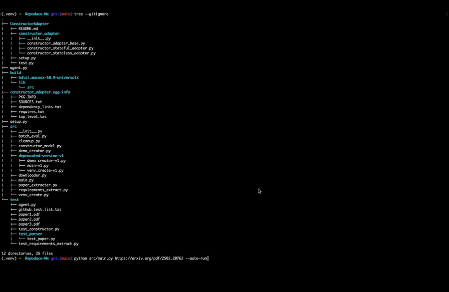

<!--
Suggested GitHub Topics: llm reproducibility research-tools arxiv python ai automation
-->

# Repoduce-Me

A streamlined pipeline that converts a research paper into a runnable demo by extracting its GitHub repository, resolving dependencies, creating an isolated environment, and generating an executable example script.

---

## Demo



> Run the pipeline on `arxiv.org/abs/2106.09685` (LoRA: Low-Rank Adaptation of Large Language Language Models) to reproduce the demo above.

---

## Results

Representative test runs across recent ML papers:

| Paper | Repo Detected | Deps Resolved | Demo Generated |
|-------|:---:|:---:|:---:|
| LoRA (arxiv 2106.09685) | ✅ | ✅ | ✅ |
| Attention Is All You Need (arxiv 1706.03762) | ✅ | ✅ | ✅ |
| CLIP (arxiv 2103.00020) | ✅ | ❌ | ❌ |

> These are representative test runs. Results depend on repository availability and dependency complexity.

---

## Core Capabilities

- Parse a paper (PDF or ArXiv URL) and detect its GitHub repo.
- Clone the repo in a temporary or persistent workspace.
- Infer or normalize Python dependencies.
- Build a Python virtual environment and install all requirements safely.
- Use a Constructor-integrated LLM to generate a runnable demo (`generated_demo.py`).
- Optionally execute the demo automatically.
- Support batch processing for multiple papers.

---

## Repository Structure

```text
Repoduce-Me/
  .gitignore
  requirements.txt
  agent.py
  src/
    main.py
    downloader.py
    paper_extracter.py
    requirements_extract.py
    venv_create.py
    demo_creator.py
    batch_eval.py
    cleanup.py
  ConstructorAdapter/
  test/
  docs/
    demo.gif
```

---

## Pipeline Overview

1. **Parse Input** — PDF or URL → extracted text.
2. **Detect GitHub Repo** — via regex or LLM fallback.
3. **Clone Repo** — into `tmp/` or `workspace/`.
4. **Infer Dependencies** — pyproject/setup/requirements or static import analysis.
5. **Build Venv** — install normalized dependencies.
6. **Generate Demo** — LLM produces `generated_demo.py`.
7. **(Optional) Auto-Run** — execute demo inside the venv.
8. **Cleanup** — remove `tmp/` and/or `workspace/`.

---

## Installation

```bash
python -m venv .venv
source .venv/bin/activate
pip install -r requirements.txt
```

Constructor adapter (optional but required for demo generation):

```bash
cd ConstructorAdapter
pip install -e .
```

Environment variables:

```
CONSTRUCTOR_API_KEY=
CONSTRUCTOR_API_URL=
CONSTRUCTOR_KM_ID=
```

---

## Usage

Run full pipeline:

```bash
python src/main.py https://arxiv.org/pdf/XXXX.YYYYY.pdf
```

Run with explicit GitHub URL:

```bash
python src/main.py paper.pdf --github https://github.com/owner/repo
```

Use ephemeral workspace:

```bash
python src/main.py URL --tmp
```

Auto-run the generated demo:

```bash
python src/main.py URL --auto-run
```

Cleanup:

```bash
python src/cleanup.py --tmp --workspace
```

---

## Batch Mode

```bash
python src/batch_eval.py
```

Processes multiple papers, records logs, and outputs aggregated summaries.

---

## Alternative LLM Backend

By default, Repoduce-Me uses the ConstructorAdapter (a wrapper around Constructor.app's LLM API). To use OpenAI instead:

1. Set the following environment variable:
   ```bash
   export OPENAI_API_KEY=sk-...
   ```

2. Modify the LLM client in `src/constructor_model.py` — replace the `ConstructorAdapter` import and instantiation with an OpenAI client call (e.g., `openai.ChatCompletion.create`).

3. The demo generation logic in `src/demo_creator.py` calls the model adapter — update the call there to use your new client.

---
